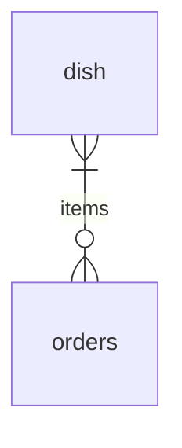
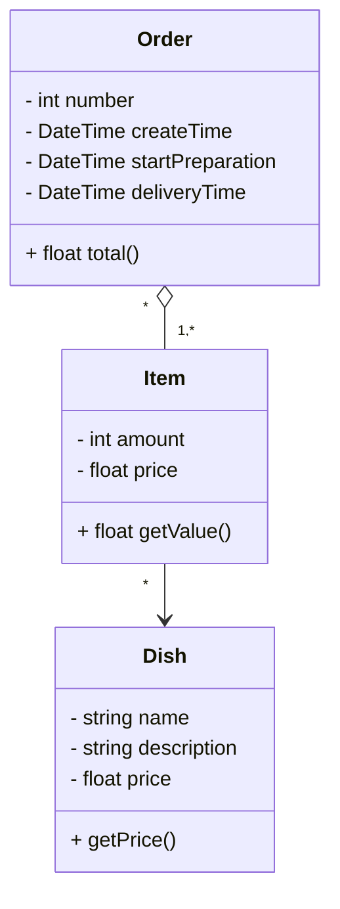

# Santander Bootcamp 2023 - Fullstack Java+Angular

## Desáfio de Projeto

Desenvolver uma API Rest usando Java e Spring Boot.

Para o desáfio irei desenvolver uma API Rest para um restaurante de fast-food.

## Modelo Entidade Relacionamento

## Diagramas de Classe

## Referências

- [App Ideias - Fast Food Simulator](https://github.com/florinpop17/app-ideas/blob/master/Projects/3-Advanced/FastFood-App.md)
- [Fast Food Simulator - Logical Workflow](https://drive.google.com/file/d/1Thfm5cFDm1OjTg_0LsIt2j1uPL5fv-Dh/view)
