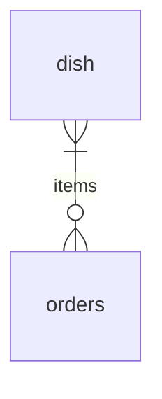
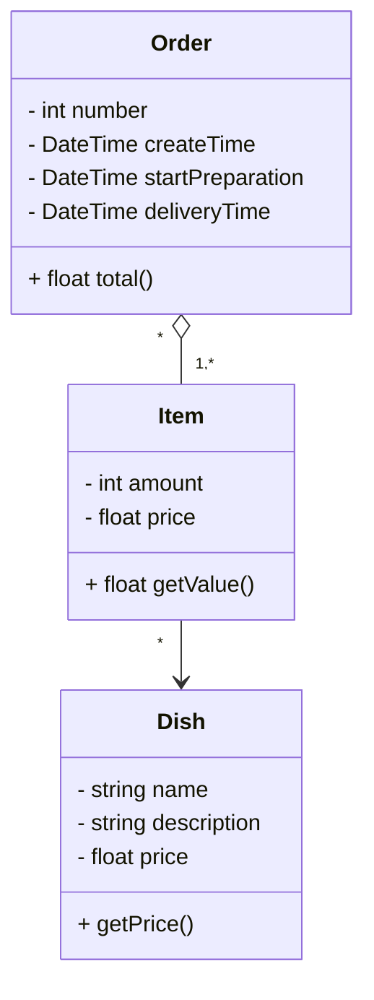

# Santander Bootcamp 2023 - Fullstack Java+Angular

Bootcamp da [DIO](https://www.dio.me/) em parceria com o [Banco Santander](https://www.santander.com.br/).

## Descrição de Projeto

Esse é um projeto de conclusão do módulo "Ganhando Produtividade com Spring Framework e Java".

Para o desáfio escolhi desenvolver uma API Rest para um restaurante de fast-food, utilizando o framework Spring Boot.

## Modelo Entidade Relacionamento

## Diagramas de Classe

## Referências

- [App Ideias - Fast Food Simulator](https://github.com/florinpop17/app-ideas/blob/master/Projects/3-Advanced/FastFood-App.md)
- [Fast Food Simulator - Logical Workflow](https://drive.google.com/file/d/1Thfm5cFDm1OjTg_0LsIt2j1uPL5fv-Dh/view)
